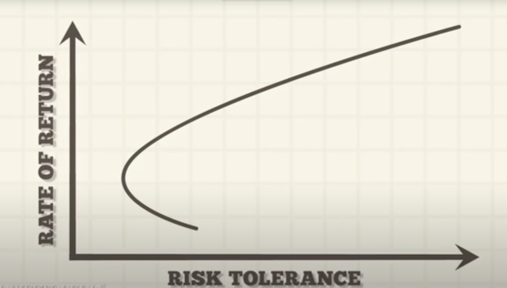

---

* TOC
{:toc}

---
## Background

Stocks are classified into different sectors (Energy, Finance, Health Care, etc), and stocks within the same sectors are assumed to have similar behaviors (movement patterns and risk profiles). Fund managers worldwide demand a precise classification to control portfolio sector exposures and thus minimize risks brought by some specific sectors. This could be considered a sector-level diversification.  

The most widely used industry classifications are [China CITIC (中信)](http://www.cs.ecitic.com/newsite/) and [SWS Research (申万宏源)](http://www.swsindex.com/idx0530.aspx) for China A-share. They provide a professional guideline for a long-term stock industry classification. However, the classification is fixed and fails to capture short-term correlations between stocks in different sectors, and thus fails to embody short-term co-movement risks between conventionally unrelated stocks. For example, China CITIC Bank (601998, 中信银行) in finance sector and Contemporary Amperex Technology (300750 宁德时代, a firm focusing on Lithium battery) in manufacturing sector are typically considered uncorrelated. Due to a recent announcement of cooperation in 2020, their stock prices started to behave similarly in a short term. This particular risk could hardly be hedged against if the fund manager use a fixed industry classification scheme.  

Therefore, a dynamic industry classification is much more recommended for institutional traders, especially hedge fund portfolio managers on low-frequency trading strategies (change stock holdings each day, for instance).  

In this project, we leverage the benefits of graph-based analysis to improve the final stage of low-frequency stock picking strategy research -- Markowitz Portfolio Optimization -- by replacing the static industry exposure constraint with a dynamic one. In other words, we are "optimizing an optimization".

For readers unfamiliar with the low-frequency quant research pipeline, the appendix could be helpful for your convenience.

<figure>

<figcaption align = "center"><b>Fig 1: PMFG + Spectral Clustering -- Trained zz1000 Member Stock Classification (2021/01/01 - 2021/12/31) </b></figcaption>
</figure>

## Graph Formulation

To create a dynamic stock classification from market data, we believe that graph techniques may help filter information and naturally represent industry information in their dense graph embeddings. In a nutshell, two stocks are connected if they demonstrate a strong correlation over the given observation time period, and by that connectivity we may partition the graph and obtain communities.

### Build Graph from Financial Data

We would like to build a graph whose nodes are stocks and edges are indicators of connectivity. Suppose there are $N$ tradable assets and $T$ days for observation, we take the time-series correlation among stocks as a criteria to add edges[[1]](#1).

To compute the time-series correlation, suppose $s_{i,t}$ is the (close) price of asset $i$ at time $t \in \{1, ..., T\}$, then the daily return is $r_{i, t} = \frac{s_{i, t} - s_{i, t - 1}}{s_{i, t - 1}}$ ($t$ starts from 2, which means there are only $T - 1$ returns). Then for any $i, j$, the time-series correlation is thus given by

$$
\rho_{ij} = \frac{\sum_{t=2}^T (r_{i, t} - \bar{r}_i)(r_{j, t} - \bar{r}_j) }{\sqrt{[\sum_{t=2}^T (r_{i, t} - \bar{r}_i)^2] [\sum_{t=2}^T (r_{j, t} - \bar{r}_j)^2]}}
$$

where

$$
\bar{r}_i = \frac{r_{i,2} +r_{i,3} + ... + r_{i, T}}{T - 1}
$$

This could be considered as the "weight" of the edge between stock $i$ and stock $j$. One sometimes need to convert weights to distance between two nodes, and a naive form is give by

$$
d_{ij} = \sqrt{2 (1 - \rho_{ij})}
$$

Given the similarity measures (correlation) and distance measures, we may build graphs by using the following methods:

* **Asset Graph (AG)**[[3]](#3): connect if $ \|\rho_{ij}\| $ is beyond a pre-defined threshold. Asset graph encapsulate global structure well but fails to capture local ones.
* **Minimum Spanning Tree (MST)**[[8]](#8)[[9]](#9): sort all $\rho_{ij}$ in a descending order, add the edge if after addition the graph is still a forest or a tree (Kruskal's Algorithm). MST matches the understanding of investors on the market, where risk propagate from a central node to others[[6]](#6), but is well-known to be unstable across time.
* **Planar Maximally Filter Graph (PMFG)**[[2]](#2)[[4]](#4)[[5]](#5): simiilar to MST, but add edge if after addition the graph is still planar.  This adds more stability to MST, but may be a little harder to train.

In addition, **Random Matrix Theory (RMT)**[[3]](#3)[[7]](#7) selects information from the correlation matrix and feed back to the previous three models as a refinement.

In this project we use all four types in our experiment.

### Community Detection from Constructed Graphs

To control the number of industry, we pick algorithms that help generate a prescribed number of clusters. The following are implemented:

* **Spectral Clustering**
* **Average Linkage Clustering**
* **Node2Vec[[10]](#10) + KMeans**: conduct KMeans on Node2Vec embeddings;
* **Sub2Vec[[11]](#11) + KMeans**: conduct KMeans on Sub2Vec embeddings.

TODO: add a demo picture

### Graph Evaluation

To evaluate if the re-constructed classification is "good", we go through the entire low-frequency stock picking pipeline and plug in new industry information in the final step -- Markowitz Portfolio Optimization -- to see if there is a performance gain in our strategy.

We focus on the following four metrics to measure performance:

* **Excess Return**: the excess return of the strategy with respect to the index / market;
* **Max Drawdown**: max decrease of the portfolio in value;
* **Turnover**: measure the rate of invested stocks being replaced by new ones;
* **AlphaSharpeRatio**: return / volatility, measure the ability of maximizing returns over risk.

TODO: put a sample backtest plot here.

The dynamic property is done by a rolling-based train test schemed outlined as follows: we train the graph using $T_{train} = 240$ days and test the performance of the graph in the following $T_{test} = 40$ days. Then we move forward $T_{test}$ days to retrain the graph. Note that the test periods are not overlapping, and the train test periods are the same in the factor combination (machine learning) part of the low-frequency stock picking paradigm. We look at the metrics of the successive testing periods in our portfolio.

<figure>

<figcaption align = "center"><b>Fig 2: Rolling Evaluation Paradigm </b></figcaption>
</figure>

## Experiment

### Data

Provided by [Shanghai Probability Quantitative Investment](http://www.probquant.cn/), this is a dataset of day-level A-share stock information.

In this project, we will focus on a particular stock pool named zz1000 (中证1000) favored by many investors. This is a pool of 1000 mid-size market cap stocks, and the pool replace stocks every 6 months. The following stats on zz1000 is taking the union of all stocks appeared in this pool in history.

|stock_pool| start_date | end_date | num_stocks | num_industry | num_features | avg_nan_rate | avg_FloatMarketValue |
|  :---: | :---: | :---: | :---: | :---: | :---: | :---: | :---: |
| All | 20150101 | 20211231 |4752 | 28 | 24 | 0.215112 | 1.363993e+10 |
| ZZ1000 | 20150101 |20211231 |1847 | 28 | 24 | 0.121805 | 6.898919e+09 |

We also list the 24 features available to compute alphafactors (for gathering excess returns) and risk factors (for controlling porfolio risks). The meaning of these names is self-explanatory.

| Price | Volume | Status | Others |
| :---: | :---: | :---: | :---: |
| AdjFactor | TurnoverRate | TradeStatus | Total Equity |
| PreClosePrice | TradeVolume | IssueStatus | |
| OpenPrice | TradeValue | STStatus | |  
| ClosePrice | FloatMarketValue | SuspendStatus | |
| DownLimitPrice | FloatShare | UpDownLimitStatus | |
| UpLimitPrice | TotalMarketValue |  | |
| HighestPrice | | | |
| LowestPrice | | | |
| Price | | | |
| VWAP |  | | |
| TrueRange | |  | |
| RangeRate | |  | |

### Experiment Details

Using LightGBM to combine 646 alphafactors based on the above features, we trained a machine learning model predicting stock daily returns. With prediction fixed, we use portfolio optimization with trained dynamic industry exposures as constraints instead (see appendix for more details). The following set of rules apply for all backtests:

* Commissions deducted (0.15%)  
* No latency/slippage (immediate order execution)
* No trading on stocks issued in their first 60 trading days or stocks hitting up limit or down limit
* Change stock weights on a daily basis
* Trade at open (open to open return)
* Trade on member stock of zz1000 and use zz1000 as the benchmark for excess return (index enhancement style)
* Select top $M = 100$ stocks on each cross-section to invest (long group)

### Performance Results

This gives the following evaluations:

**Stock Pool**: zz1000 member stocks  
**Benchmark**: zz1000 index  
**Time Period**: 20170701 - 20211231  

| Model | AlphaReturn (cumsum) | AlphaSharpe | AlphaDrawdown | Turnover |
| :-----: | :---------------------: | :----------: | :-----------: | :------: |
| LgbmRegressor | 145.64 | **3.65** | **-11.58** | 1.21 |
| LgbmRegressor-opt | **146.73** | 2.96 | -29.79 | 1.11 |
| .. | .. | .. | .. | .. | .. |
| 40-cluster PMFG Unfiltered Spectral | 154.45 | 3.15 | **-22.69** | 1.11 |
| 10-cluster PMFG Filtered Average Linkage | 160.95 | **3.32** | -26.77 | 1.11 |
| 30-cluster AG Unfiltered Sub2Vec | 160.96 | 3.24 | -23.05 | 1.10 |
| 5-cluster MST Unfiltered Sub2Vec | 163.26 | 3.27 | -27.39 | 1.11 |
| **20-cluster PMFG Filtered Node2Vec** | **164.68** | 3.30 | -27.06 | 1.11 |

Compared to the original optimization result, we observe a **12.23%** improvement in excess return and **12.16%** improvement in excess Sharpe ratio.

Since factors based on price and volume are known to have lost their predictive power staring from 20200701, we also look at the performances when they still were still helpful for prediction.

**Stock Pool**: zz1000 member stocks  
**Benchmark**: zz1000 index  
**Time Period**: 20170701 - 20200701

| Model | AlphaReturn (cumsum) | AlphaSharpe | AlphaDrawdown | Turnover |
| :-----: | :---------------------: | :----------: | :-----------: | :------: |
| LgbmRegressor | 150.64 | 6.06 | **-4.59** | 1.23 |
| LgbmRegressor-opt | **170.31** | 5.43 | -6.76 | 1.12 |
| .. | .. | .. | .. | .. | .. |
| 10-cluster PMFG Filtered Sub2Vec | 173.10 | 5.49 | **-5.51** | 1.12 |
| 5-cluster MST Filtered Sub2Vec | 182.89 | 5.78 | -7.14 | 1.12 |
| 10-cluster AG Filtered Sub2Vec | 181.50 | 5.64 | -7.40 | 1.12 |
| **20-cluster PMFG Filtered Node2Vec** | **184.21** | **5.85** | -6.42 | 1.12 |

In this period, we observe a **8.16%** improvement in excess return and a **7.73%** improvement in excess Sharpe ratio, compared to the original optimization result.

In both time periods, filtered PMFG yielding 20 clusters using Node2Vec gives the best result in overall excess return.

Although improvements are observed in overall excess return, none of the "optimized" result beats the original prediction in Sharpe Ratio or drawdown control. That is, the optimizer sacrifices return per unit risk (Sharpe) to achieve higher overall excess return, and this is likely due to a strict constraint in turnover rate. It is empirically, however, possible for Markowitz portfolio optimization to improve both Sharpe ratio and excess return. More data, in-particular higher-frequency ones, are required to supply a better prediction with lower turnover rate to start with so that turnover constraint can be satisfied without sacrificing much of Sharpe ratio.

For a complete list of results, check out [summary_20170701_20211231.csv](https://github.com/yangshengaa/dynamic_stock_industry_classification/blob/main/out/res/signal_test_file_20220305_long_experiment/summary.csv) and [summary_20170701_20200701.csv](https://github.com/yangshengaa/dynamic_stock_industry_classification/blob/main/out/res/signal_test_file_20220305_short_experiment/summary.csv) available on github.

### Performance Breakdown

We examine the results in detail and observe the following:

* Exceptional performance gains are not due to randomness
* Filtering helps improve Sharpe Ratio
* Demonstrate a potential for further improvements in theory by the efficient frontier

#### Improvements Are Not Due to Randomness

Since all optimization are based on the same prediction (for each day, the set of stocks invested are the same across different optimization results), we simulate weights for the selected $M = 100$ stock each day using technique introduced by Fan et al. (2016)[[13]](#13). To uniformly generate positive weights $\xi_i: \sum_{i=1}^M \xi_i = 1$, one may generate i.i.d. $X_i \sim Exp(1)$ and set $\xi_i = X_i / \sum_{i=1}^M X_i$.

In the following plot, grey lines are simulated PnL curves, black line is the original optimized one, and others are curves using dynamic industry. None of the 1000 simulated curves supersedes optimized ones, which concludes that the optimized results are not due to random.

<figure>

<figcaption align = "center"><b>Fig 3: PnL Curves with simulation </b></figcaption>
</figure>

Moreover, we notice that the majority of optimization using a dynamic ones beat the original optimization, particularly before 20200701, starting from which the PnL curve no longer grows due to ineffective factors, affirming at least empirically that using a dynamic industry classification does help improve the optimization.

#### Filtering On Average Performs Better than Unfiltered Ones

The followings are six violin plots examining if filtering helps improve Sharpe ratio. From top to bottom, we split the trained industry by number of clusters, clustering type, and graph type respectively. The left column is the full period (20170701 - 20211231) and the right column is the truncated one (20170701 - 20200701). Within each of the plot, the left portion of each violin is the unfiltered performance and the right is the filtered counterparts.

<table>
<tr>
<td>  </td>
<td>  </td>
</tr>
<tr>
<td>  </td>
<td>  </td>
</tr>
<tr>
<td>  </td>
<td>  </td>
</tr>
</table>
<figcaption align = "center"><b>Fig 4: AlphaSharpe in Different Dimensions </b></figcaption>

We also see that there is little difference between different number of clusters prescribed, but that average linkage performs better than node2vec and sub2vec on average, and that MST and PMFG perform better than AG on average.

#### Further Improvement in Theory

To gauge the efficiency of mining returns per unit of risk, we may plot excess returns against realized risk. Here we use the max drawdown as a proxy for risk. The more it appear towards the top left (large return, small risk), the better it is, since it could gather more returns per unit of risk.

Ideally, as risk increases, more returns are expected, since returns are (arguably) the compensations for risks. However, we observe a undesired downward trend in the best fit lines for respective type of graphs during both the full period and the truncated one.

<figure>

<figcaption align = "center"><b>Fig 5: Return vs. Drawdown (20170701 - 20211231) </b></figcaption>
</figure>

<figure>

<figcaption align = "center"><b>Fig 6: Return vs. Drawdown (20170701 - 20200701) </b></figcaption>
</figure>

For comparison, here is the efficient frontier in theory.

<figure>

<figcaption align = "center"><b>Fig 7: Efficient Frontier (by Investopedia) </b></figcaption>
</figure>

The exhibited downward trends show that our optimized results may not be hitting the efficient frontier. The way to reach the frontier is subject to further investigations.

Notice that the best fit lines reaffirm the rough equivalence between MST and PMFG, and that they are better than AG, matching the conclusion above.

### Interpretability

TODO: ...

## Conclusion

TODO: ...

## Appendix: Low-Frequency Stock-Picking Procedure Breakdown

In low-frequency quantitative investment research, the central goal is to predict future daily returns as accurate as possible. There are the following four steps[[12]](#12):

* **Mine Factors**: perform feature engineering on stock information to facilitate predicting future returns;  
* **Combine Factors**: use machine learning algorithms to combine mined factors to predict future return;  
* **Portfolio Sort/Backtest**: at each day, given the prediction, pick the top $M$ number of stocks with the highest returns from all tradable stocks ($M$ depends on the stock pool, in this project $M = 100$). Mimic this using the history data to test if the predictions are accurate;  
* **Portfolio Optimization**: given the selected stocks, assign appropriate weights to each one to control the overall risk exposure (Industry Exposure, for instance).

**In this project, we would like to use graph-based analysis to re-classify stocks and see if a dynamic industry classification could help improve portfolio optimization performance.** The performance is measured by overall returns and realized volatility given a tested timeframe.

### Mine Factors

Starting from 1960s, people started to use factor model to predict stock returns. CAPM (Capital Asset Pricing Model) was one of the first formal attempts. Suppose we have $N$ tradable assets, the simplified form is written below:

$$\mathbb{E}(R_i^e) = \alpha_i + \beta_i \lambda_{market}, \; \forall i \in \{1, ..., N\}$$

where $\mathbb{E}(R_i^e)$ is the predicted future return of asset $i$ and $\lambda_{market} = \mathbb{E}(R_m)$ is a factor and is the current market return. That is, future stock return depends on current market return. A simple linear regression could help us identify the exact values of the coefficients for each asset $i$.  

In 1993, FF3 (Fama-French Three-Factor Model) was proposed and its author later won the Nobel Prize in Economic Sciences. It builds on CAPM and appended two other factors: market capitalization and book-to-market (BM) ratio.

$$\mathbb{E}(R_i^e) = \alpha_i + \beta_{i, market} \lambda_{market} + \beta_{i, cap} \lambda_{cap} + \beta_{i, bm} \lambda_{bm}, \; \forall i \in \{1, ..., N\}$$

One could observe that there is nothing stopping us from adding more factors (more features typically brings lower MSE in regression tasks, although collinearity needs to be either eliminated or circumvented by picking an ML model that is robust to collinearity). Many modern quant practitioner focus on mining factors. Suppose we have $K$ factors, then our model becomes

$$\mathbb{E}(R_i^e) = \alpha_i + \sum_{k=1}^K \beta_{i, k} \lambda_{k} = \alpha_i + \mathbb{\beta}_i^T \mathbb{\lambda}, \; \forall i \in \{1, ..., N\}$$

where $\mathbb{\beta}_i, \mathbb{\lambda} \in \mathbb{R}^K$.

In a hedge fund, usually $K > 2000$. But for limited data and computing resources, in this project $K = 646$. These includes factors computed from daily price and volume data (momentum, reversal, idiosyncratic returns, technical indicators, and other confidential ones).

### Combine Factors

With the model above, we would like to obtain the trained values for $$\mathbb{\beta}_i$$
to predict future stock returns. Suppose we have $ N $ assets, $ K $ factors, and pick $ T $ days to be our training period ($T_{train} = 240$ in this project. This is roughly a year since there are only 245 trading days per year), the $ X $, features, and $ y $, prediction goal, are constructed in the following way: we flatten each factors and vertically concat them with correct dates aligned, and then do the same thing for the return panel data. Features in different dates in the same training period are equally weighted, though it is known empirically that an exponential decay on dates could boost performance.

<figure>

<figcaption align = "center"><b>Fig 3: Construction of Features X and Observation y </b></figcaption>
</figure>

For scalibility, we focus on LightGBM regressor. LinearRegressor is also included for performance comparison.

### Portfolio Sort / Backtest

With the trained model, we could now predict the returns for all tradable stocks tomorrow. Pick the top $M$ stocks ($M = 100$ in this project, and essentially this is picking one-tenth of the stocks from the pool of zz1000). $M$ should not be too small since our prediction may be wrong, capturing stocks not with the hightest returns; nor could $M$ be too large, since we may not have enough money to invest in all of them (there is a minimum purchase requirement per stock).

Basic backtest config includes deducting costs (0.0015) for each trade, and we exclude stocks with special treatment (ST), stocks delisted, stocks meeting their limit up/down (making it non-tradable), and newly issued stocks (60 days after listing). Benchmark index is the zz1000 index for computing excess returns.

### Portfolio Optimization

With $M$ stocks selected, we would like to know the exact weights of each investment to control the overall risk exposure. Suppose $R \in \mathbb{R}^M$ is the predicted return of the $M$ stocks (machine learning output), $\Sigma \in \mathbb{R}^{M \times M}$  the estimated covariance matrix, and $x \in \mathbb{R}^M$ the weights for each stocks, we have the following constraint optimization problem:

$$
\begin{align*}
    &\max_x \ \ R^T x - \lambda x^T \Sigma x \\
    s.t. \ \ &\forall i: \ \ W_{low} \leq x_i \leq W_{high}, \ \ \sum_{i=1}^n x_i = 1 \ \ (\text{Holding Constraint}) \\
    &\forall m:  \ \ S_{low} \leq (x^T - w_{bench}^T) X_{style_m} \leq S_{high} \
(\text{Style Exposure Constraint}) \\
    &\forall k:  \ \ I_{low} \leq (x^T - w_{bench}^T) X_{ind_k} \leq I_{high} \
(\text{Industry Exposure Constraint}) \\
    &\sum_{i=1}^n |x - x_{t-1}| \leq TO_{limit}\  (\text{Turnover Constraint})
\end{align*}
$$

The objective function means we would like to maximize returns and minimize risk at the same time. $\lambda = 10$ empirically works the best.

Each constraint comes with a different purpose:

* **Holding Constraint**: no short-selling, so all weights shall be positive, and we don't want to over-invest in one stock, so there is also an upper limit for a single stock weight;
* **Style Exposure**: style factors are also called risk factors, including Market-Cap, Momentum, and others. We would like its exposure to be controlled over time, and not using these factors to obtain excess returns;
* **Industry Exposure**: prevent over-investing in a single industry. This is the place where an alternative dynamic classification is plugged in.
* **Turnover Constraint**: limit the rate of replacement of the stocks to lower costs.

## Acknowledgement

Special thanks to coworkers and my best friends at Shanghai Probability Quantitative Investment: Beilei Xu, Zhongyuan Wang, Zhenghang Xie, Cong Chen, Yihao Zhou, Weilin Chen, Yuhan Tao, Wan Zheng, and many others. This project would be impossible without their data, insights, and experiences.

## Reference

<a id="1">[1]</a>
Gautier Marti, Frank Nielsen, Mikołaj Bińkowski, Philippe Donnat (2020).
A review of two decades of correlations, hierarchies, networks and clustering in financial markets.
Signals and Communication Technology.

<a id="2">[2]</a>
Tumminello, M. and Aste, T. and Di Matteo, T. and Mantegna, R. N. (2005).
A tool for filtering information in complex systems.
Proceedings of the National Academy of Sciences.

<a id="3">[3]</a>
Mel MacMahon, Diego Garlaschelli (2014). Community detection for correlation matrices. Physical Review X.

<a id="4">[4]</a>
Won-Min Song,T. Di Matteo,Tomaso Aste (2012). Hierarchical Information Clustering by Means of Topologically Embedded Graphs. PLoS ONE 7(3).

<a id="5">[5]</a>
Won-Min Song, T. Di Matteo, Tomaso Aste (2009). Nested hierarchies in planar graphs. Discrete Applied Mathematics.

<a id="6">[6]</a>
Amelie Hüttner, Jan-Frederik Mai and Stefano Mineo (2018). Portfolio selection based on graphs: Does it align with Markowitz-optimal portfolios? Dependence Modeling.

<a id="7">[7]</a>
V. Plerou, P. Gopikrishnan, B. Rosenow, L. A. N. Amaral, T. Guhr, H. E. Stanley (2001). A Random Matrix Approach to Cross-Correlations in Financial Data. Physical Review E.

<a id="8">[8]</a>
R. N. Mantegna (1999), Hierarchical structure in financial markets, The European Physical Journal B-Condensed Matter and Complex Systems 11.

<a id="9">[9]</a>
R. N. Mantegna, H. E. Stanley (1999). Introduction to econophysics: correlations and complexity in finance, Cambridge university press.

<a id="10">[10]</a>
Aditya Grover, Jure Leskovec (2016). node2vec: Scalable Feature Learning for Networks.

<a id="11">[11]</a>
Bijaya Adhikari, Yao Zhang, Naren Ramakrishnan, B. Aditya Prakash (2017). Distributed Representation of Subgraphs.

<a id="12">[12]</a>
石川, 刘洋溢, 连祥斌 (2020). 因子投资方法与实践.

<a id="13">[13]</a>
Jianqing Fan, Weichen Wang, Yiqiao Zhong (2016). Robust Covariance Estimation for Approximate Factor Models.

TODO: add more
