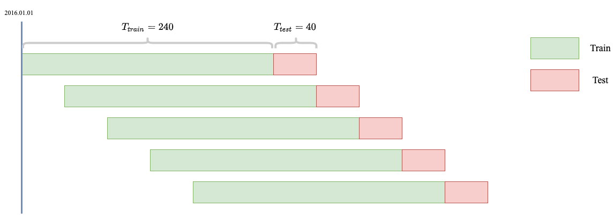

## Background

Stocks are classified into different sectors (Energy, Finance, Health Care, etc), and stocks within the same sectors are assumed to have similar behaviors (movement patterns and risk profiles). Fund managers worldwide demand a precise classification to control portfolio sector exposures and thus minimize risks brought by some specific sectors. This could be considered a sector-level diversification.  

The most widely used industry classifications are China CITIC (中信) and SWS Research (申万宏源) for China A-share. They provide a professional guideline for a long-term stock industry classification. However, the classification is fixed and fails to capture short-term correlations between stocks in different sectors, and thus fails to embody short-term co-movement risks between conventionally unrelated stocks. For example, company A in finance sector and company B in energy sector are typically considered uncorrelated. Due to a recent announcement of cooperation, their stock prices started to behave similarly. This particular risk could hardly be hedged against if the fund manager use a fixed industry classification scheme.  

Therefore, a dynamic industry classification is much more recommended for institutional traders, especially hedge fund portfolio managers on low-frequency trading strategies (change stock holdings each day, for instance).  

<figure>

<figcaption align = "center"><b>Fig 1: Trained zz1000 Member Stock Classification (2021/01/01 - 2021/12/31) </b></figcaption>
</figure>

## Graph Formulation

To re-classify stocks from stock data, we believe that graph helps filter information and compare otherwise hard-to-contrast variables (price movements in this case) to obtain hidden embeddings of industry information. In a nutshell, two stocks are connected if they demonstrate a strong correlation over the given observation time period, and by that connectivity we may partition the graph and obtain communities.

### Build Graph from Financial Data

We would like to build a graph whose nodes are stocks and edges are indicators of connectivity. Suppose there are $N$ tradable assets and $T$ days for observation, we take the time-series correlation among stocks as a criteria to add edges.

To compute the time-series correlation, suppose $s_{i,t}$ is the (close) price of asset   at time  $t \in \{1, ..., T\}$, then the daily return is $r_{i, t} = \frac{s_{i, t} - s_{i, t - 1}}{s_{i, t - 1}}$ ($t$ starts from 2, which means there are only $T - 1$ returns). Then for any $i, j$, the time-series correlation is thus given by
$$\rho_{ij} = \frac{\sum_{t=2}^T (r_{i, t} - \bar{r}_i)(r_{j, t} - \bar{r}_j) }{\sqrt{[\sum_{t=2}^T (r_{i, t} - \bar{r}_i)^2] [\sum_{t=2}^T (r_{j, t} - \bar{r}_j)^2]}}$$
where $\bar{r}_i = \frac{\sum_{t = 2}^T r_{i, t}}{T - 1}$. This could be considered as the "weight" of the edge between stock $i$ and stock $j$. One sometimes need to convert weights to distance between two nodes, and a naive form is give by
$$d_{ij} = \sqrt{2 (1 - \rho_{ij})}$$

Given the similarity measures (correlation) and distance measures, we may build graphs by using the following methods:

- **Asset Graph (AG)**: connect if $|\rho_{ij}|$ is beyond a pre-defined threshold;  
- **Minimum Spanning Tree (MST)**: sort all $\rho_{ij}$ in a descending order, add the edge if after addition the graph is still a forest or a tree (Kruskal's Algorithm);  
- **Planar Maximally Filter Graph (PMFG)**: simiilar to MST, but add edge if after addition the graph is still planar;
- **Random Matrix Theory (RMT)**: select information from the correlation matrix and feed back to the previous three models as a refinement.

In this project we use all four types in our experiment.

### Community Detection from Constructed Graphs

To control the number of industry, we pick algorithms that help generate a prescribed number of clusters. The following are implemented:

- **Spectral Clustering**
- **Average Linkage Clustering**
- **Node2Vec + KMeans**: conduct KMeans on Node2Vec embeddings;
- **Sub2Vec + KMeans**: conduct KMeans on Sub2Vec embeddings.

### Graph Evaluation

To evaluate if the re-constructed classification is "good", we go through the entire low-frequency stock picking pipeline and plug in new industry information in the final step -- Markowitz Portfolio Optimization -- to see if there is a performance gain in our strategy.

We focus on the following four metrics to measure performance:

- excess return: the excess return of the strategy with respect to the index / market;
- max drawdowns: max decrease of the portfolio in value;
- turnover: measure the rate of invested stocks being replaced by new ones;
- AlphaSharpeRatio: return / volatility, measure the ability of maximizing returns over risk.

The dynamic property is done by a rolling-based train test schemed outlined as follows: we train the graph using $T_{train} = 240$ days and test the performance of the graph in the following $T_{test} = 40$ days. Then we move forward $T_{test}$ days to retrain the graph. Note that the test periods are not overlapping, and the train test periods are the same in the factor combination (machine learning) part of the low-frequency stock picking paradigm. We look at the metrics of the successive testing periods in our portfolio.

<figure>

<figcaption align = "center"><b>Fig 2: Rolling Evaluation Paradigm </b></figcaption>
</figure>

## Experiment

### Data

Provided by Shanghai Probability Quantitative Investment, this is a dataset of day-level A-share stock information.

In this project, we will focus on a particular stock pool named zz1000 (中证1000) favored by many investors. This is a pool of 1000 mid-size market cap stocks, and the pool replace stocks every 6 months. The following stats on zz1000 is taking the union of all stocks appeared in this pool in history.

|stock_pool| start_date | end_date | num_stocks | num_industry | num_features | avg_nan_rate | avg_FloatMarketValue |
|  :---: | :---: | :---: | :---: | :---: | :---: | :---: | :---: |
| All | 20150101 | 20211231 |4752 | 28 | 24 | 0.215112 | 1.363993e+10 |
| ZZ1000 | 20150101 |20211231 |1847 | 28 | 24 | 0.121805 | 6.898919e+09 |

We also list the features available to compute alphafactors (for gathering excess returns) and risk factors (for controling porfolio risks). The meaning of these names is self-explanatory.

- 'AdjFactor'
- 'ClosePrice'
- 'DownLimitPrice'
- 'FloatMarketValue'
- 'FloatShare'
- 'HighestPrice'
- 'IssueStatus'
- 'LowestPrice'
- 'OpenPrice'
- 'PreClosePrice'
- 'Price'
- 'RangeRate'
- 'STStatus'
- 'SuspendStatus'
- 'TotalMarketValue'
- 'TradeStatus'
- 'TradeValue'
- 'TradeVolume'
- 'TrueRange'
- 'TurnoverRate'
- 'UpDownLimitStatus'
- 'UpLimitPrice'
- 'VWAP'
- 'fund'

### Experiment Details

TODO: ...

### Interpretability

TODO: ...

## Conclusion

TODO: ...

## Appendix: Low-Frequency Stock-Picking Precedure Breakdown

In low-frequency quantitative investment research, the central goal is to predict future daily returns as accurate as possible. There are the following four steps:

- **Mine Factors**: perform feature engineering on stock information to facilitate predicting future returns;  
- **Combine Factors**: use machine learning algorithms to combine mined factors to predict future return;  
- **Portfolio Sort/Backtest**: at each day, given the prediction, pick the top $M$ number of stocks with the highest returns from all tradable stocks ($M$ depends on the stock pool, in this project $M = 100$). Mimic this using the history data to test if the predictions are accurate;  
- **Portfolio Optimization**: given the selected stocks, assign appropriate weights to each one to control the overall risk exposure (Industry Exposure, for instance).

**In this project, we would like to use graph-based analysis to re-classify stocks and see if a dynamic industry classification could help improve portfolio optimization performance.** The performance is measured by overall returns and realized volatility given a tested timeframe.

### Mine Factors

Starting from 1960s, people started to use factor model to predict stock returns. CAPM (Capital Asset Pricing Model) was one of the first formal attempts. Suppose we have $N$ tradable assets, the simplified form is written below:

$$\mathbb{E}(R_i^e) = \alpha_i + \beta_i \lambda_{market}, \; \forall i \in \{1, ..., N\}$$

where $\mathbb{E}(R_i^e)$ is the predicted future return of asset $i$ and $\lambda_{market} = \mathbb{E}(R_m)$ is a factor and is the current market return. That is, future stock return depends on current market return. A simple linear regression could help us identify the exact values of the coefficients for each asset $i$.  

In 1993, FF3 (Fama-French Three-Factor Model) was proposed and its author later won the Nobel Prize in Economic Sciences. It builds on CAPM and appended two other factors: market capitalization and book-to-market (BM) ratio.

$$\mathbb{E}(R_i^e) = \alpha_i + \beta_{i, market} \lambda_{market} + \beta_{i, cap} \lambda_{cap} + \beta_{i, bm} \lambda_{bm}, \; \forall i \in \{1, ..., N\}$$

One could observe that there is nothing stopping us from adding more factors (more features typically brings lower MSE in regression tasks, although collinearity needs to be either eliminated or circumvented by picking an ML model that is robust to collinearity). Many modern quant practitioner focus on mining factors. Suppose we have $K$ factors, then our model becomes
$$\mathbb{E}(R_i^e) = \alpha_i + \sum_{k=1}^K \beta_{i, k} \lambda_{k} = \alpha_i + \mathbb{\beta}_i^T \mathbb{\lambda}, \; \forall i \in \{1, ..., N\}$$
where $\mathbb{\beta}_i, \mathbb{\lambda} \in \mathbb{R}^K$.

In a hedge fund, usually $K > 2000$. But for limited data and computing resources, in this project $K = 646$. These includes factors computed from daily price and volume data (momentum, reversal, idiosyncratic returns, technical indicators, and other confidential ones).

### Combine Factors

With the model above, we would like to obtain the trained values for $\mathbb{\beta}_i$ to predict future stock returns. Suppose we have $N$ assets, $K$ factors, and pick $T$ days to be our training period ($T_{train} = 240$ in this project. This is roughly a year since there are only 245 trading days per year), the $X$, features, and $y$, prediction goal, are constructed in the following way: we flatten each factors and vertically concat them with correct dates aligned, and then do the same thing for the return panel data. Features in different dates in the same training period are equally weighted, though it is known empirically that an exponential decay on dates could boost performance.

<figure>

<figcaption align = "center"><b>Fig 3: Construction of Features X and Observation y </b></figcaption>
</figure>

For scalibility, we focus on LightGBM regressor. LinearRegressor is also included for performance comparison.

### Porfolio Sort / Backtest

With the trained model, we could now predict the returns for all tradable stocks tomorrow. Pick the top $M$ stocks ($M = 100$ in this project, and essentially this is picking one-tenth of the stocks from the pool of zz1000). $M$ should not be too small since our prediction may be wrong, capturing stocks not with the hightest returns; nor could $M$ be too large, since we may not have enough money to invest in all of them (there is a minimum purchase requirement per stock).

Basic backtest config includes deducting costs (0.0015) for each trade, and we exclude stocks with special treatment (ST), stocks delisted, stocks meeting their limit up/down (making it non-tradable), and newly issued stocks (60 days after listing). Benchmark index is the zz1000 index for computing excess returns.

### Portfolio Optimization

With $M$ stocks selected, we would like to know the exact weights of each investment to control the overall risk exposure. Suppose $R \in \mathbb{R}^M$ is the predicted return of the $M$ stocks (machine learning output), $\Sigma \in \mathbb{R}^{M \times M}$  the estimated covariance matrix, and $x \in \mathbb{R}^M$ the weights for each stocks, we have the following constraint optimization problem:

\begin{align*}
    &\max_x \ \ R^T x - \lambda x^T \Sigma x \\
    s.t. \ \ &\forall i: \ \ W_{low} \leq x_i \leq W_{high}, \ \ \sum_{i=1}^n x_i = 1 \ \ (\text{Holding Constraint}) \\
    &\forall m:  \ \ S_{low} \leq (x^T - w_{bench}^T) X_{style_m} \leq S_{high} \
(\text{Style Exposure Constraint}) \\
    &\forall k:  \ \ I_{low} \leq (x^T - w_{bench}^T) X_{ind_k} \leq I_{high} \
(\text{Industry Exposure Constraint}) \\
    &\sum_{i=1}^n |x - x_{t-1}| \leq TO_{limit}\  (\text{Turnover Constraint})
\end{align*}

The objective function means we would like to maximize returns and minimize risk at the same time. $\lambda = 10$ empirically works the best.

Each constraint comes with a different purpose:

- **Holding Constraint**: no short-selling, so all weights shall be postive, and we don't want to over-invest in one stock, so there is also an upper limit for a single stock weight;
- **Style Exposure**: style factors are also called risk factors, including Market-Cap, Momentum, and others. We would like its exposure to be controlled over time, and not using these factors to obtain excess returns;
- **Industry Exposure**: prevent over-investing in a single industry. This is the place where an alternative dynamic classification is plugged in.
- **Turnover Constraint**: limit the rate of replacement of the stocks to lower costs.

## Reference

TODO: ...
