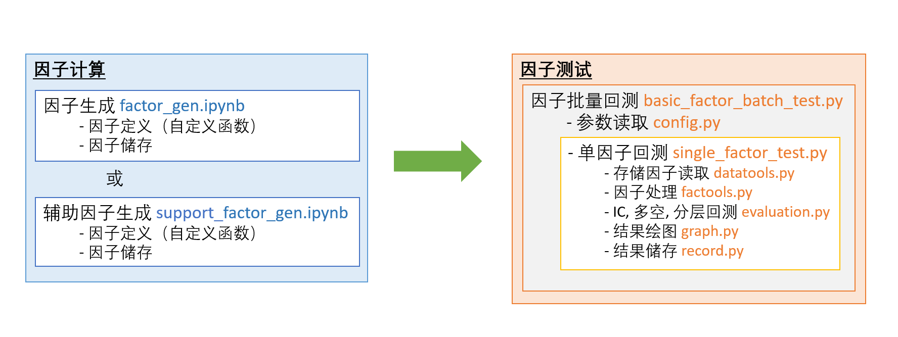
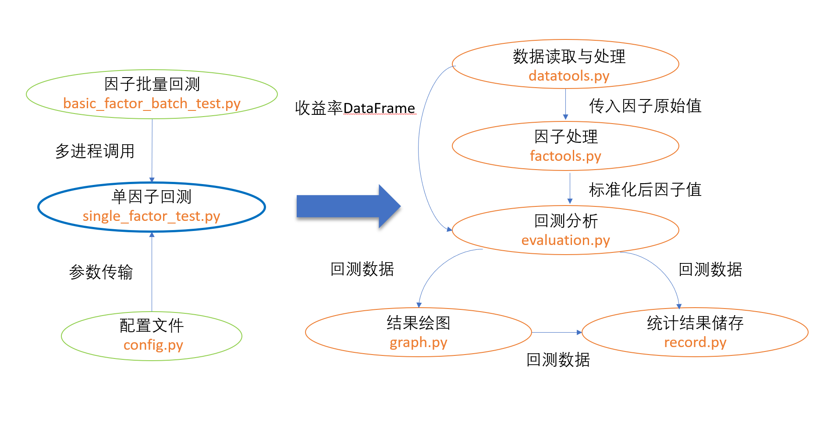

# backtest

The Backtest module supports the following:

- examine if there is any abnormal values in factors [preview.py](bin/preview.py);
- backtest in a given period and compute all relevant statistics, including AlphaReturn, AlphaSharpe, and etc;
- backtest stats breakdown by year;
- output stock holding (for portfolio optimization later)
- Barra risk analysis

## Project Breakdown 项目结构

## Backtest Procedure

因子测试部分涉及以下几个步骤：

### 1. Backtest Configuration 回测参数设置

在[config.py](configuration/config.py)中设置参数。具体参数有：

| 回测参数 | 数据类型 | 参数描述 | 可选值 |
| --- | :---: | --- | --- |
| `start_date` | str | 回测开始日期 | '20200101' |
| `end_date` | str | 回测截至日期 | '20201231' |
| `adj_freq` | int | 调仓周期 | 合理的正整数即可，如3 |
| `freq` | str | 调仓模式 | 'D'或'W' (目前'W'暂不可用) |
| `group_num` | int | 分组测试的分组数量 |  如10组或20组 |
| `head` |  int | 多空组分别选取的股票数 | 如400 |
| `cost` | float |  双边手续费 | 如 0.0015 |
| `return_type` | str | 收益率回看模式 | vtv, oto, 但主要是看oto, 为了对标指数 |
| `ic_decay` | int | IC的衰减测试最长周期 | 长周期可选100，短周期可选10 |
| `decay_list` | list(int) | 不同持仓时间的绩效 | 如 [1,3,5,10] |
| `weight_index_by_fmv` | bool | 是否用流通市值加权计算基准收益率 | 详见config |
| `index_list`| list(str) | 交易票池 | sz50, hs300, zz500, zz1000, zzall, 以及这些的组合 |
| `fix_stocks`| bool | 是否用静态交易票池 | True则用静态（读取configuration中的txt；False则用动态票池 |
| `fixed_pool`| str | 静态票池标的 | sz50, hs300, zz500, zz1000, zzall （对应的txt） |
| `use_independent_return_benchmark`| bool | 是否用独立基准 | False用`index_list`对应的指数作为收益率基准，True则用`return_benchmark_index`作为收益率基准 |
| `return_benchmark_index`| str | 基准票池 | sz50, hs300, zz500, zz1000, zzall |
| `risk_plot_required`| bool | 是否测算风格归因 | Ture or False （若true，则必须先在因子生成平台生成过一遍才可以用，否则会报错） |
| `risk_plot_benchmark_index`| str | 计算超额权重的基准 | '000016', '000300', '000905', '000852' 四个|
| `factor_config` | dict |  因子处理方式，包括取极值、中性化、标准化   | 详见config文件|
| `factor_name` | str |  单因子测试中的待测因子 | 如‘mom_20'|
| `factor_name_list` | list |  批量测试中的待测因子 | 详见config文件|

**票池的特别说明**：

目前平台分离了交易票池与收益率基准票池，支持不同的票池作为交易票池和收益率基准的测算。总结如下：

- 交易票池：支持
  - 自选（静态，读取txt，回测周期内不变）；
  - 动态（历史指数动态成分股）；
- 基准票池：支持
  - 与交易票池相同的指数（等权或市值加权）的测算模式
  - 独立的单个指数

举以下几个简单的例子：

- 如果需要用历史1500市值加权动态票池交易但对标500作为基准收益率序列，需设置
  - `weight_index_by_fmv = True`
  - `index_list = ['zz500', 'zz1000']`
  - `fix_stocks = False`
  - `fixed_pool` 无所谓
  - `use_independent_return_benchmark = True`
  - `return_benchmark_index = 'zz500'`
- 如果需要用历史上出现过的中证1000成分股作为交易票池，对标动态的中证1000作为基准，需设置
  - `weight_index_by_fmv` 无所谓
  - `index_list = ['zz1000']` # 其实无所谓但必须填，用到的还是independent benchmark
  - `fix_stocks = True`
  - `fixed_pool = 'zz1000'`
  - `use_independent_return_benchmark = True`
  - `return_benchmark_index = 'zz1000'`

### 2. Single Factor Backtest 单因子测试流程

因子储存到自定义路径，同时设置好[config.py](configuration/config.py)后：

- **cd 进入bin** (必须进入bin再运行程序！)  
- run [single_factor_test.py](bin/single_factor_test.py)

### 3. Batch Factor Backtest 单因子批量测试流程

因子储存到自定义路径，同时设置好[config.py](configuration/config.py)，特别是其中的`factor_name_list`后：

- **cd 进入bin** (必须进入bin再运行程序！)  
- run [batch_factor_test.py](bin/batch_factor_test.py)

### 4. Result Digestion 回测结果

详见[回测说明](docs/回测说明.md) （TODO）

### 5. Signal BackTest 信号回测

通过 [batch_signal_test.py](bin/batch_signal_test.py)和[single_signal_test.py](bin/single_signal_test.py),
我们可以输入多空信号（-1/0/1），输出绩效，对于无法因子化的一些技术指标测试，可以使用这个。

### 6. Weight BackTest 权重回测

输入权重df，输出绩效

## Quick Start

It's very easy to build a complete Quant research workflow and try your ideas with low_freq_alpha_test!

[demo](notebooks/demo.ipynb)步骤如下：

### Factor Generation 因子生成

- clone project;
- 在[demo](notebooks/demo.ipynb)中修改因子生成路径;
- 运行[demo](notebooks/demo.ipynb)里的所有cells.

### Single Factor BackTest 单因子回测

- 进入config.py, 设置

~~~python
factor_name=factor
~~~

（factor为上一步生成的某因子，如‘mom_20'）

- 设置因子读取路径如

~~~python
factor_path = "/home/xxx/factors"
~~~

- cd进入bin文件夹
- run [single_factor_test.py](bin/single_factor_test.py)

### Batch Factor BackTest 批量回测

- 进入config.py, 设置

~~~python
factor_name_list = [factor_1,factor_2...factor_n]
~~~

(factor_1,factor_2等为目前想要回测的因子)

- cd 进入bin
- run [batch_factor_test.py](bin/batch_factor_test.py)

## For Developer 开发者笔记

每次发版前要做一些测试，看看修改后对于上一个master有无什么变化。可以用下列因子测全票等权的情况做核对:

- mom_5
- Size (Barra 市值因子)
- 某个组合的结果 (如lgbm或者xgb模型)
- 某个Pairs因子
